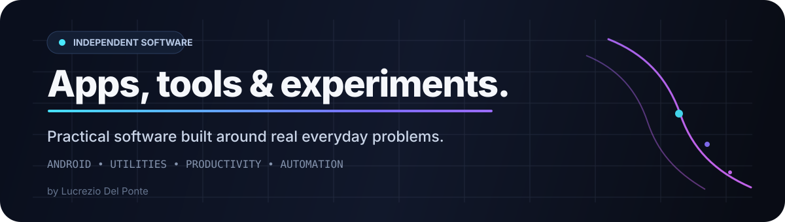
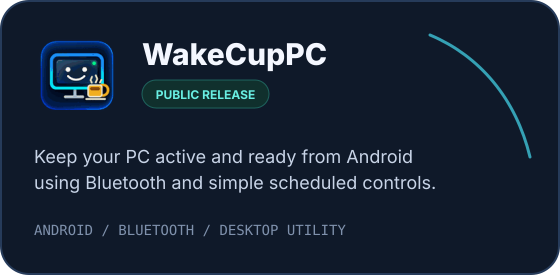
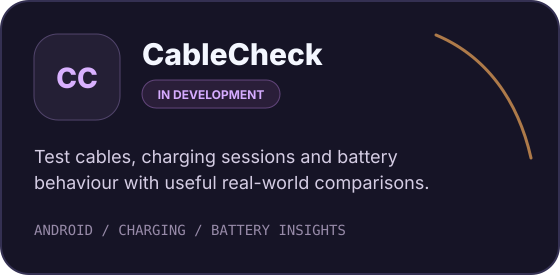

<div align="center">



<br/>

<a href="https://github.com/lucrezio0987"></a>
<a href="https://www.instagram.com/lucrezio0987_org/"></a>
<a href="https://www.producthunt.com/@lucrezio0987"></a>

</div>

<br/>

## ✦ Products

<table>
<tr>
<td width="50%" valign="top">

<a href="https://play.google.com/store/apps/details?id=com.lucrezio0987.hidautoinput2">
  
</a>

<br/>

### WakeCupPC

Keep your PC active, awake and ready from your Android phone using Bluetooth, schedules and direct controls.

**Status** · Public release  
**Platforms** · Android + PC workflow

<br/>

<a href="https://play.google.com/store/apps/details?id=com.lucrezio0987.hidautoinput2"></a>

</td>
<td width="50%" valign="top">



<br/>

### CableCheck

Understand real charging performance across cables, sessions and devices with practical battery and charging insights.

**Status** · In active development  
**Platform** · Android

<br/>


</td>
</tr>
</table>

> CableCheck is using a temporary organization card until its final app icon is ready.

<br/>

## ◇ What lives here

This organization is the **technical home for the products I build**.

```text
products/        apps and software projects
releases/        public builds and technical changelogs
docs/            product and developer documentation
experiments/     ideas that may become future products
```

Public repositories will appear here when exposing the source, documentation or issue tracker adds real value to a product.

<br/>

## ↗ Releases & announcements

| Channel | Purpose |
|---|---|
| **Google Play** | Android downloads and production releases |
| **GitHub Releases** | Versioned binaries and technical changelogs where applicable |
| **GitHub Discussions** | Organization-wide announcements and product updates when enabled |
| **Product Hunt** | Public launches |
| **Instagram** | Visual previews, short demos and release highlights |

<br/>

## ⚙︎ Product principles

<table>
<tr>
<td align="center" width="25%"><b>Useful</b><br/><sub>solve a real problem</sub></td>
<td align="center" width="25%"><b>Focused</b><br/><sub>do the core job well</sub></td>
<td align="center" width="25%"><b>Understandable</b><br/><sub>clear UX over complexity</sub></td>
<td align="center" width="25%"><b>Iterative</b><br/><sub>ship, learn, improve</sub></td>
</tr>
</table>

<br/>

## ◎ Connect

<div align="center">

<a href="https://github.com/lucrezio0987"></a>
<a href="https://www.instagram.com/lucrezio0987_org/"></a>
<a href="https://www.producthunt.com/@lucrezio0987"></a>

</div>

<br/>

<div align="center">

### Practical software for everyday problems.

<sub>Independent projects by Lucrezio Del Ponte</sub>

</div>
